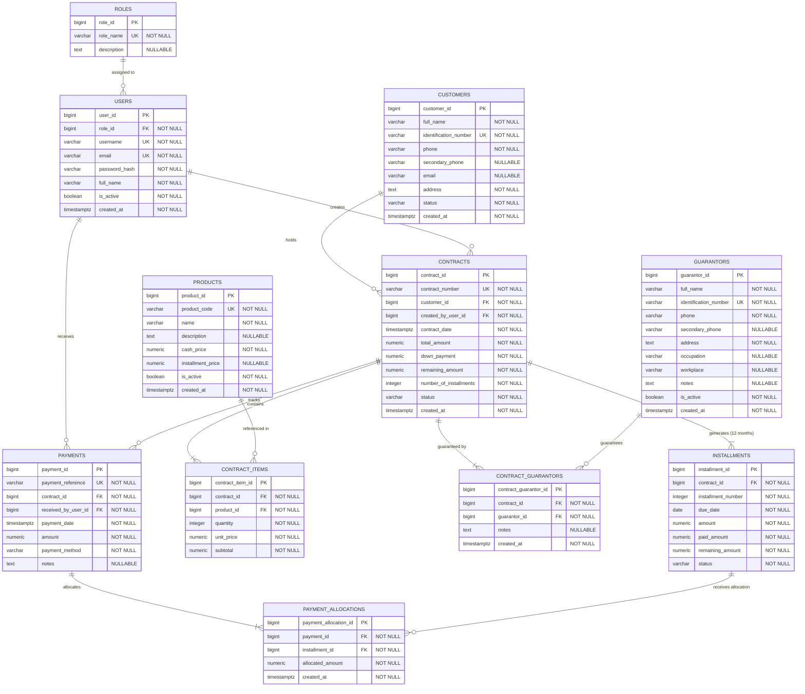

# Installment Management System (IMS) - Entity Relationship Diagram (ERD) & Database Specification

---

## 1. Executive Summary

This document defines the official **Entity Relationship Diagram (ERD)** and logical database specification for the **Installment Management System (IMS)** based on the system documentation in `docs/INSTALLMENT_MANAGEMENT_SYSTEM_DOCUMENTATION.md` and confirmed business rules.

The system is designed targeting **C#** application logic and **PostgreSQL** relational storage. This specification follows strict 3rd Normal Form (3NF) relational principles to ensure data integrity, auditability, accurate balance tracking, and zero data duplication.

### Confirmed Business Parameters:
* **Contract Duration**: Fixed 12-month (1-year) contract term generating exactly 12 monthly installments.
* **Multi-Installment Payments**: Supported via a normalized `PaymentAllocations` junction entity allowing one cash payment receipt to cover multiple installments.
* **Guarantor Requirement**: Mandatory legal guarantor / co-signer relationship attached to contracts via `ContractGuarantors`.
* **Late Payment Policy**: 0% interest and 0 penalties on past-due installments. Overdue status is tracked for collection purposes without increasing the financial amount owed.

---

## 2. Visual Entity Relationship Diagram (Mermaid ERD)



---

## 3. Entity Specifications & Attribute Dictionary

### 3.1 Roles (`Roles`)
* **Purpose**: Stores system role definitions for Role-Based Access Control (RBAC).

| Attribute | Data Type | Nullability | Constraints | Description |
| :--- | :--- | :--- | :--- | :--- |
| `role_id` | `BigInt` | **NOT NULL** | **PK**, Auto-increment | Unique identifier for the role |
| `role_name` | `VarChar(50)` | **NOT NULL** | **Unique** | Name of the role (e.g., 'Admin', 'Financial Manager', 'Sales Agent', 'Collection Officer', 'Auditor') |
| `description` | `Text` | *NULLABLE* | None | Brief explanation of role permissions |

---

### 3.2 Users (`Users`)
* **Purpose**: Stores application user profiles, credentials, and access statuses.

| Attribute | Data Type | Nullability | Constraints | Description |
| :--- | :--- | :--- | :--- | :--- |
| `user_id` | `BigInt` | **NOT NULL** | **PK**, Auto-increment | Unique identifier for the user |
| `role_id` | `BigInt` | **NOT NULL** | **FK** $\rightarrow$ `Roles(role_id)` | Reference to the assigned security role |
| `username` | `VarChar(50)` | **NOT NULL** | **Unique** | Account login identifier |
| `email` | `VarChar(100)` | **NOT NULL** | **Unique** | Official email address |
| `password_hash` | `VarChar(255)` | **NOT NULL** | None | Salted cryptographic password hash (Argon2id/bcrypt) |
| `full_name` | `VarChar(100)` | **NOT NULL** | None | Full legal name of the employee |
| `is_active` | `Boolean` | **NOT NULL** | Default `TRUE` | User account enablement flag |
| `created_at` | `TimestampTZ` | **NOT NULL** | Default `CURRENT_TIMESTAMP` | Account creation timestamp |

---

### 3.3 Customers (`Customers`)
* **Purpose**: Manages customer profiles, identity credentials, and contact records.

| Attribute | Data Type | Nullability | Constraints | Description |
| :--- | :--- | :--- | :--- | :--- |
| `customer_id` | `BigInt` | **NOT NULL** | **PK**, Auto-increment | Unique identifier for the customer |
| `full_name` | `VarChar(150)` | **NOT NULL** | None | Full legal customer name |
| `identification_number`| `VarChar(50)` | **NOT NULL** | **Unique** | Official National Identification / Civil ID Number |
| `phone` | `VarChar(20)` | **NOT NULL** | None | Primary contact phone number |
| `secondary_phone` | `VarChar(20)` | *NULLABLE* | None | Alternative contact phone number for the customer |
| `email` | `VarChar(100)` | *NULLABLE* | None | Customer email address |
| `address` | `Text` | **NOT NULL** | None | Physical residence address |
| `status` | `VarChar(20)` | **NOT NULL** | Default `'Active'` | Customer operational status ('Active', 'Inactive', 'Blacklisted') |
| `created_at` | `TimestampTZ` | **NOT NULL** | Default `CURRENT_TIMESTAMP` | Profile creation timestamp |

---

### 3.4 Products (`Products`)
* **Purpose**: Reference catalog of inventory items eligible for installment financing.

| Attribute | Data Type | Nullability | Constraints | Description |
| :--- | :--- | :--- | :--- | :--- |
| `product_id` | `BigInt` | **NOT NULL** | **PK**, Auto-increment | Unique identifier for the product |
| `product_code` | `VarChar(50)` | **NOT NULL** | **Unique** | Product SKU or internal reference code |
| `name` | `VarChar(150)` | **NOT NULL** | None | Product title / model name |
| `description` | `Text` | *NULLABLE* | None | Product specifications & details |
| `cash_price` | `Numeric(15,2)`| **NOT NULL** | Check $\ge 0.00$ | Baseline cash retail price |
| `installment_price` | `Numeric(15,2)`| *NULLABLE* | Check $\ge 0.00$ | Baseline total installment price (Optional override) |
| `is_active` | `Boolean` | **NOT NULL** | Default `TRUE` | Availability flag for new contracts |
| `created_at` | `TimestampTZ` | **NOT NULL** | Default `CURRENT_TIMESTAMP` | Record creation timestamp |

---

### 3.5 Contracts (`Contracts`)
* **Purpose**: Central financing agreement entity linking a customer, financial parameters, and fixed 12-month duration.

| Attribute | Data Type | Nullability | Constraints | Description |
| :--- | :--- | :--- | :--- | :--- |
| `contract_id` | `BigInt` | **NOT NULL** | **PK**, Auto-increment | Unique identifier for the contract |
| `contract_number` | `VarChar(50)` | **NOT NULL** | **Unique** | Human-readable contract reference (e.g., `CNT-2026-0001`) |
| `customer_id` | `BigInt` | **NOT NULL** | **FK** $\rightarrow$ `Customers(customer_id)` | Linked customer |
| `created_by_user_id` | `BigInt` | **NOT NULL** | **FK** $\rightarrow$ `Users(user_id)` | Staff member who drafted/created the contract |
| `contract_date` | `TimestampTZ` | **NOT NULL** | None | Official contract execution timestamp |
| `total_amount` | `Numeric(15,2)`| **NOT NULL** | Check $> 0.00$ | Agreed total selling price for all items |
| `down_payment` | `Numeric(15,2)`| **NOT NULL** | Check $\ge 0.00$ | Initial cash payment collected at signing |
| `remaining_amount` | `Numeric(15,2)`| **NOT NULL** | Check $\ge 0.00$ | Financed principal balance (`total_amount - down_payment`) |
| `number_of_installments`| `Integer` | **NOT NULL** | Default `12`, Check `= 12` | Fixed count of 12 monthly installments (1-year period) |
| `status` | `VarChar(20)` | **NOT NULL** | Default `'Draft'` | State ('Draft', 'Active', 'Completed', 'Voided', 'Defaulted') |
| `created_at` | `TimestampTZ` | **NOT NULL** | Default `CURRENT_TIMESTAMP` | Contract record creation timestamp |

---

### 3.6 Contract Items (`ContractItems`)
* **Purpose**: Associative junction entity supporting multi-product contracts ($N:M$ link between `Contracts` and `Products`).

| Attribute | Data Type | Nullability | Constraints | Description |
| :--- | :--- | :--- | :--- | :--- |
| `contract_item_id` | `BigInt` | **NOT NULL** | **PK**, Auto-increment | Unique item line identifier |
| `contract_id` | `BigInt` | **NOT NULL** | **FK** $\rightarrow$ `Contracts(contract_id)` | Parent contract reference |
| `product_id` | `BigInt` | **NOT NULL** | **FK** $\rightarrow$ `Products(product_id)` | Referenced catalog product |
| `quantity` | `Integer` | **NOT NULL** | Check $> 0$ | Number of units purchased |
| `unit_price` | `Numeric(15,2)`| **NOT NULL** | Check $\ge 0.00$ | Agreed unit price locked at contract signing |
| `subtotal` | `Numeric(15,2)`| **NOT NULL** | Check $\ge 0.00$ | Line item total (`quantity * unit_price`) |

---

### 3.7 Guarantors (`Guarantors`)
* **Purpose**: Manages profiles, contact details, identity credentials, and employment context of legal contract guarantors/co-signers.

| Attribute | Data Type | Nullability | Constraints | Description |
| :--- | :--- | :--- | :--- | :--- |
| `guarantor_id` | `BigInt` | **NOT NULL** | **PK**, Auto-increment | Unique identifier for the guarantor |
| `full_name` | `VarChar(150)` | **NOT NULL** | None | Full legal name of the guarantor |
| `identification_number`| `VarChar(50)` | **NOT NULL** | **Unique** | Official National Identification / Civil ID Number |
| `phone` | `VarChar(20)` | **NOT NULL** | None | Primary contact phone number |
| `secondary_phone` | `VarChar(20)` | *NULLABLE* | None | Alternative contact phone number |
| `address` | `Text` | **NOT NULL** | None | Physical residence address |
| `occupation` | `VarChar(100)` | *NULLABLE* | None | Profession / job title |
| `workplace` | `VarChar(150)` | *NULLABLE* | None | Employer name or business organization |
| `notes` | `Text` | *NULLABLE* | None | Background notes or legal remarks |
| `is_active` | `Boolean` | **NOT NULL** | Default `TRUE` | Active operational status flag |
| `created_at` | `TimestampTZ` | **NOT NULL** | Default `CURRENT_TIMESTAMP` | Profile creation timestamp |

---

### 3.8 Contract Guarantors (`ContractGuarantors`)
* **Purpose**: Associative junction entity creating a normalized $N:M$ link between `Contracts` and `Guarantors`, supporting mandatory contract guarantee verification and flexible multi-guarantor assignment.

| Attribute | Data Type | Nullability | Constraints | Description |
| :--- | :--- | :--- | :--- | :--- |
| `contract_guarantor_id`| `BigInt` | **NOT NULL** | **PK**, Auto-increment | Unique contract-guarantor link identifier |
| `contract_id` | `BigInt` | **NOT NULL** | **FK** $\rightarrow$ `Contracts(contract_id)` | Guaranteed contract reference |
| `guarantor_id` | `BigInt` | **NOT NULL** | **FK** $\rightarrow$ `Guarantors(guarantor_id)` | Assigned legal guarantor reference |
| `notes` | `Text` | *NULLABLE* | None | Contract-specific guarantee notes or role remarks |
| `created_at` | `TimestampTZ` | **NOT NULL** | Default `CURRENT_TIMESTAMP` | Assignment timestamp |

---

### 3.9 Installments (`Installments`)
* **Purpose**: Represents individual monthly due payment obligations generated under a 12-month contract schedule.

| Attribute | Data Type | Nullability | Constraints | Description |
| :--- | :--- | :--- | :--- | :--- |
| `installment_id` | `BigInt` | **NOT NULL** | **PK**, Auto-increment | Unique installment identifier |
| `contract_id` | `BigInt` | **NOT NULL** | **FK** $\rightarrow$ `Contracts(contract_id)` | Parent contract reference |
| `installment_number`| `Integer` | **NOT NULL** | Check `1..12`, Unique within Contract | Sequential installment index ($1, 2, \dots, 12$) |
| `due_date` | `Date` | **NOT NULL** | None | Calendar date when monthly payment is due |
| `amount` | `Numeric(15,2)`| **NOT NULL** | Check $> 0.00$ | Fixed expected payment amount for this month |
| `paid_amount` | `Numeric(15,2)`| **NOT NULL** | Default `0.00`, Check $\ge 0$ | Accumulated amount paid towards this installment |
| `remaining_amount` | `Numeric(15,2)`| **NOT NULL** | Check $\ge 0.00$ | Unpaid balance (`amount - paid_amount`) |
| `status` | `VarChar(20)` | **NOT NULL** | Default `'Pending'` | Status ('Pending', 'Paid', 'Partially Paid', 'Overdue', 'Waived') |

---

### 3.10 Payments (`Payments`)
* **Purpose**: Represents actual financial cash collection transactions executed by a customer against a contract.

| Attribute | Data Type | Nullability | Constraints | Description |
| :--- | :--- | :--- | :--- | :--- |
| `payment_id` | `BigInt` | **NOT NULL** | **PK**, Auto-increment | Unique payment transaction identifier |
| `payment_reference` | `VarChar(50)` | **NOT NULL** | **Unique** | Official receipt number (e.g., `PAY-2026-00089`) |
| `contract_id` | `BigInt` | **NOT NULL** | **FK** $\rightarrow$ `Contracts(contract_id)` | Target contract reference |
| `received_by_user_id`| `BigInt` | **NOT NULL** | **FK** $\rightarrow$ `Users(user_id)` | Collection Officer / Cashier who accepted payment |
| `payment_date` | `TimestampTZ` | **NOT NULL** | Default `CURRENT_TIMESTAMP` | Transaction execution timestamp |
| `amount` | `Numeric(15,2)`| **NOT NULL** | Check $> 0.00$ | Total cash amount collected in this single transaction |
| `payment_method` | `VarChar(30)` | **NOT NULL** | None | Payment instrument ('Cash', 'Bank Transfer', 'Cheque') |
| `notes` | `Text` | *NULLABLE* | None | Transaction notes or reference memo |

---

### 3.11 Payment Allocations (`PaymentAllocations`)
* **Purpose**: Associative entity mapping how a single `Payment` transaction amount is distributed across one or multiple `Installments`.

| Attribute | Data Type | Nullability | Constraints | Description |
| :--- | :--- | :--- | :--- | :--- |
| `payment_allocation_id`| `BigInt` | **NOT NULL** | **PK**, Auto-increment | Unique allocation record identifier |
| `payment_id` | `BigInt` | **NOT NULL** | **FK** $\rightarrow$ `Payments(payment_id)` | Parent payment transaction reference |
| `installment_id` | `BigInt` | **NOT NULL** | **FK** $\rightarrow$ `Installments(installment_id)` | Targeted installment schedule entry |
| `allocated_amount` | `Numeric(15,2)`| **NOT NULL** | Check $> 0.00$ | Monetary portion of payment applied to this installment |
| `created_at` | `TimestampTZ` | **NOT NULL** | Default `CURRENT_TIMESTAMP` | Allocation timestamp |

---

## 4. Conceptual Data Flow & Relationship Rules

### 4.1 Data Flow Architectural Model
```
Contract
   │
   ├──> ContractItems (N:M Products)
   ├──> ContractGuarantors (N:M Guarantors)
   └──> Installments (Exactly 12 Monthly Rows)
          ▲
          │
      PaymentAllocations (N:M Mapping)
          ▲
          │
       Payment (1 Cash Receipt Event)
```

### 4.2 Relationship Definitions & Cardinalities

1. **`Roles` $\rightarrow$ `Users` (`1 : N`)**:
   * **Cardinality**: One Role can be assigned to zero, one, or multiple Users. Each User MUST belong to exactly one Role.
   * **Integrity**: `ON DELETE RESTRICT`.

2. **`Customers` $\rightarrow$ `Contracts` (`1 : N`)**:
   * **Cardinality**: One Customer can hold zero, one, or multiple Contracts. Each Contract MUST belong to exactly one Customer.
   * **Integrity**: `ON DELETE RESTRICT`.

3. **`Users` $\rightarrow$ `Contracts` (`1 : N`)**:
   * **Cardinality**: One User can create zero, one, or multiple Contracts. Each Contract MUST record exactly one creating User.
   * **Integrity**: `ON DELETE RESTRICT`.

4. **`Contracts` $\rightarrow$ `ContractItems` (`1 : N`) & `Products` $\rightarrow$ `ContractItems` (`1 : N`)**:
   * **Cardinality**: One Contract contains one or multiple `ContractItems`. Each `ContractItem` belongs to exactly one Contract and references exactly one `Product`.
   * **Integrity**: `ON DELETE CASCADE` from Contract; `ON DELETE RESTRICT` from Product.

5. **`Contracts` $\rightarrow$ `ContractGuarantors` (`1 : N`) & `Guarantors` $\rightarrow$ `ContractGuarantors` (`1 : N`)**:
   * **Cardinality**: One Contract MUST have one or multiple `ContractGuarantors` (at least 1 mandatory guarantor per contract). Each `ContractGuarantor` entry links exactly one Contract to exactly one Guarantor. One Guarantor can guarantee zero, one, or multiple Contracts.
   * **Integrity**: `ON DELETE CASCADE` from Contract; `ON DELETE RESTRICT` from Guarantor.

6. **`Contracts` $\rightarrow$ `Installments` (`1 : N`)**:
   * **Cardinality**: One Contract generates exactly **12 monthly Installments**. Each Installment MUST belong to exactly one Contract.
   * **Integrity**: `ON DELETE CASCADE` when in `Draft` state; `RESTRICT` once `Active`.

7. **`Contracts` $\rightarrow$ `Payments` (`1 : N`)**:
   * **Cardinality**: One Contract can accumulate zero, one, or multiple Payment transaction receipts over its lifecycle. Each Payment belongs to exactly one Contract.
   * **Integrity**: `ON DELETE RESTRICT`.

8. **`Payments` $\rightarrow$ `PaymentAllocations` (`1 : N`)**:
   * **Cardinality**: One Payment transaction MUST generate one or multiple `PaymentAllocations` (1 allocation if paying 1 installment; $K$ allocations if paying $K$ installments in one lump sum).
   * **Integrity**: `ON DELETE RESTRICT`.

9. **`Installments` $\rightarrow$ `PaymentAllocations` (`1 : N`)**:
   * **Cardinality**: One Installment can receive zero, one, or multiple `PaymentAllocations` (to support partial payments over time).
   * **Integrity**: `ON DELETE RESTRICT`.

10. **`Users` $\rightarrow$ `Payments` (`1 : N`)**:
   * **Cardinality**: One Collection Officer User can record zero, one, or multiple Payments. Each Payment MUST record the receiving User ID.
   * **Integrity**: `ON DELETE RESTRICT`.

---

## 5. Design Decisions

1. **Normalized Payment Distribution via `PaymentAllocations`**:
   * *Decision*: Removed direct `installment_id` from `Payments` and introduced `PaymentAllocations` linking `Payments` to `Installments`.
   * *Rationale*: Preserves the real-world financial event (`Payments` receipt) as a single transaction while allowing lump-sum payments covering multiple installments (e.g., a single 300,000 IQD payment distributed as three 100,000 IQD allocations across Installments #1, #2, and #3). Eliminates redundant foreign keys and prevents data inconsistency.
   * *Invariant Constraint*: $\sum (\text{allocated\_amount}) = \text{Payment.amount}$.

2. **Fixed 12-Month Contract & Schedule Standard**:
   * *Decision*: Set `number_of_installments` default to 12 monthly periods ($N=12$).
   * *Rationale*: Aligns with confirmed business owner rules establishing a standard 1-year financing lifecycle per contract.

3. **Zero Late Fees & Zero Interest Penalty Model**:
   * *Decision*: Excluded `penalty_amount` and `interest_amount` fields from `Installments` and `Payments`.
   * *Rationale*: Business rules explicitly dictate that past-due installments transition to `status = 'Overdue'` for collection monitoring without increasing the monetary principal owed by the customer.

4. **Independent Guarantor Entity & Junction Model (`Guarantors` & `ContractGuarantors`)**:
   * *Decision*: Modeled `Guarantors` as a top-level entity linked to `Contracts` via `ContractGuarantors`.
   * *Rationale*: Satisfies mandatory legal guarantor requirements, prevents personal data duplication, enables one person to guarantee multiple contracts, and supports multi-guarantor assignments.

5. **Explicit Associative Table (`ContractItems`)**:
   * *Decision*: Used an explicit `ContractItems` junction entity.
   * *Rationale*: Supports bundling multiple products per contract while locking agreed historical unit prices.

6. **Surrogate Primary Keys (`BigInt`) & 3NF Alignment**:
   * *Decision*: All entities use 64-bit integer surrogate keys (`BigInt`) paired with unique business natural keys (`contract_number`, `identification_number`, `product_code`, `payment_reference`).
   * *Rationale*: High performance indexing, minimal storage footprint, and clean normalized relationships.

---

## 6. Status of Business Rules & Team Sign-Off

All core business parameters, schema relationships, payment allocation workflows, and penalty policies have been **FULLY CONFIRMED** by the business owner:

| Parameter | Confirmed Rule | Schema Status |
| :--- | :--- | :--- |
| **Guarantor Policy** | Mandatory legal guarantor per contract; supports multi-guarantors | **Confirmed & Modeled** (`Guarantors` + `ContractGuarantors`) |
| **Contract Duration** | Fixed 12 monthly installments (1-year period) | **Confirmed & Modeled** (`Contracts.number_of_installments = 12`) |
| **Multi-Installment Payment** | Supported via single cash payment distributed across N installments | **Confirmed & Modeled** (`PaymentAllocations` junction entity) |
| **Late Fees & Interest** | 0% interest, $0 penalty fees on overdue installments | **Confirmed & Modeled** (Strict 0-penalty schema structure) |
| **Product Pricing** | Standard baseline catalog pricing utilized | **Confirmed & Modeled** (`Products.cash_price` locked in `ContractItems`) |

**Final Verification**: The database design is 100% normalized (3NF), robust, fully documented, and ready for PostgreSQL migration script creation upon development sprint launch.
